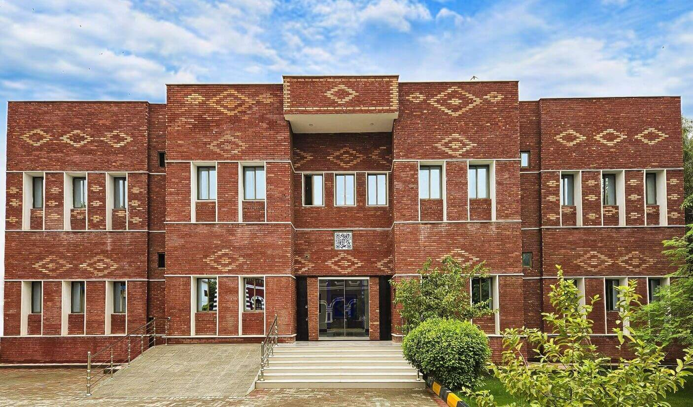

# Abdul Majid Bhurgri Institute of Language Engineering (AMBILE)

The Abdul Majid Bhurgri Institute of Language Engineering (AMBILE) is a pioneering institution dedicated to advancing the Sindhi language through computational linguistics and natural language processing. Established under the Culture, Tourism, Antiquities, and Archives Department, Government of Sindh, AMBILE aims to elevate the Sindhi language to be on par with national and international languages in all computational processes.

## Timeline of Establishment

- Idea development: 2016  
- Announced by Hon’able Minister: 2017  
- Foundation of Building: 2018  
- Inauguration of the institute: 2019  
- Working on projects: 2020  

## Leadership

- Abdul-Majid Bhurgri – Lifetime Co-Chairman, Founder of Sindhi Computing  
- Syed Zulfiqar Ali Shah – Chairman, Minister Culture, Government of Sindh  
- Khair Muhammad Kalwar – Vice Chairman, Secretary Culture, Government of Sindh  

## History

In recognition of the services of Abdul-Majid Bhurgri, the founder of Sindhi computing, the Government of Sindh established the institute in his name. The institute was initiated based on a concept presented by language engineer and linguist Amar Fayaz Buriro in a briefing to the Minister, Culture, Tourism, Antiquities & Archives, Government of Sindh on 18 August 2016. Following this, the minister announced the establishment of the institute and the Government of Sindh included its development in the 2017-2018 budget.

## Functions

The functions of AMBILE, as outlined in "The Abdul Majid Bhurgri Institute of Language Engineering Act, 2019, Sindh Act No. XVI of 2021," include:

- Standardizing computational processing and voice synthesis of the Sindhi language  
- Developing automatic online Sindhi translations and transliterations to other international languages and scripts  
- Developing online web portals for Sindhi literature  
- Localizing cellular technology, robotics, and artificial intelligence in the Sindhi language  
- Training professionals in Sindhi Language Engineering to meet future AI needs  
- Building a consortium between national and international stakeholders working on language engineering  
- Publishing research papers, studies, and collaborative works of value to the institute  

## Mission

To innovate and implement cutting-edge language engineering solutions that preserve, promote, and enhance the Sindhi language by integrating it into modern technological frameworks.

## Vision

To advance the development and integration of Sindhi language technology, ensuring its preservation and promotion in the digital age through research, innovation, and creation of linguistic resources.

## Contact

- Email: info@ambile.pk  
- Phone: +92 (22) 924-0290  
- Address: Behind Sindh Museum, N-5, Hyderabad – Sindh  

---

Visit the official website for more information: [https://ambile.pk/about-us/](https://ambile.pk)
